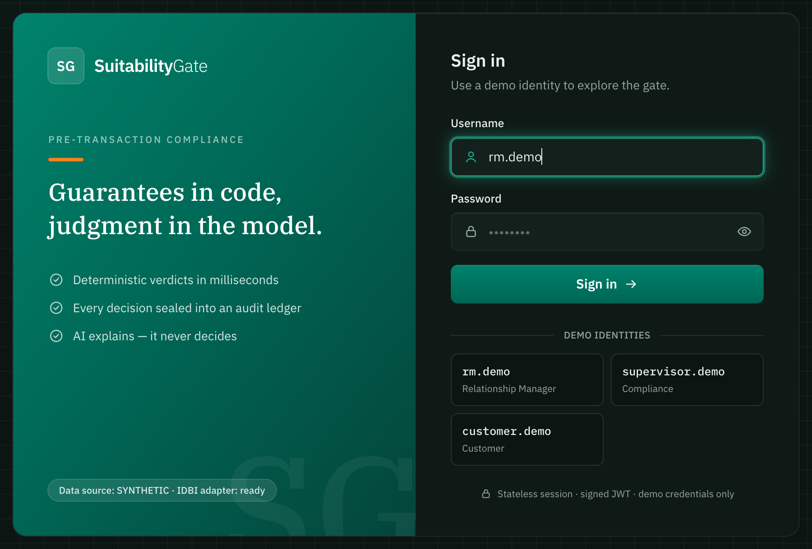
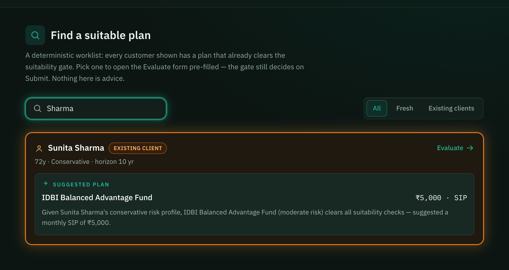
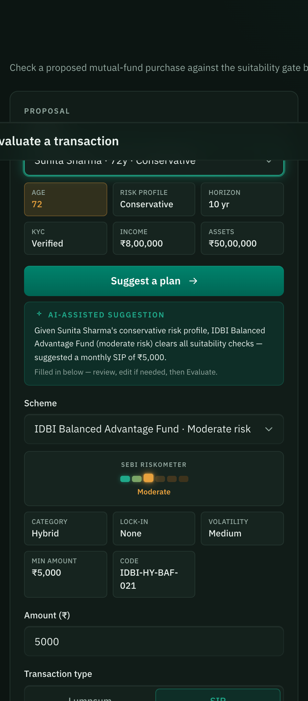
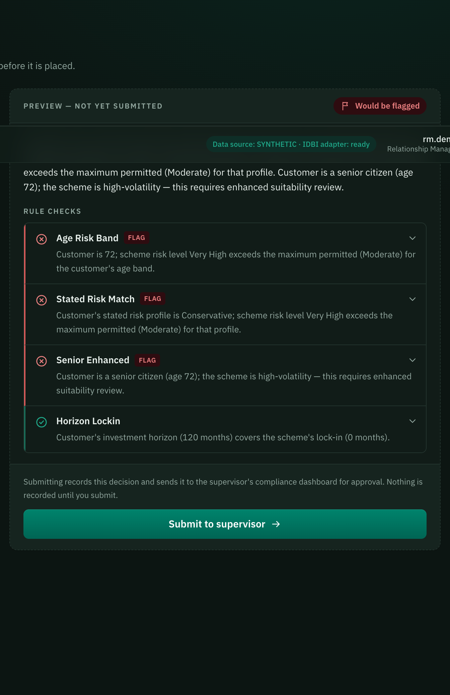
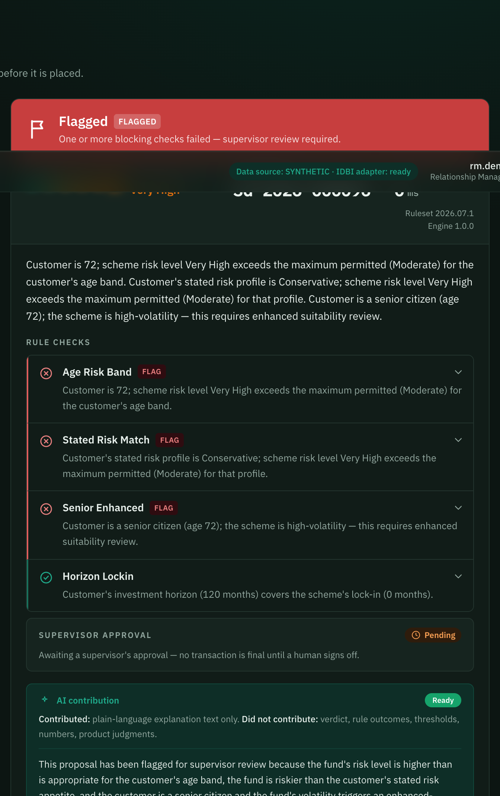
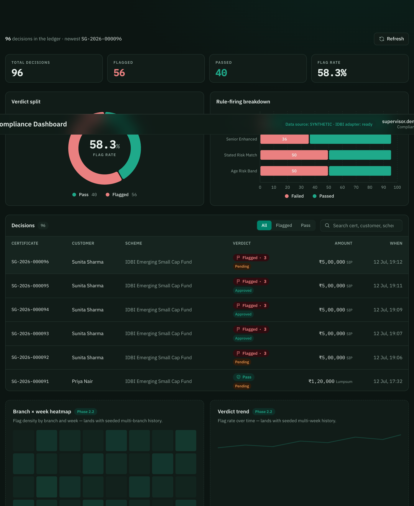
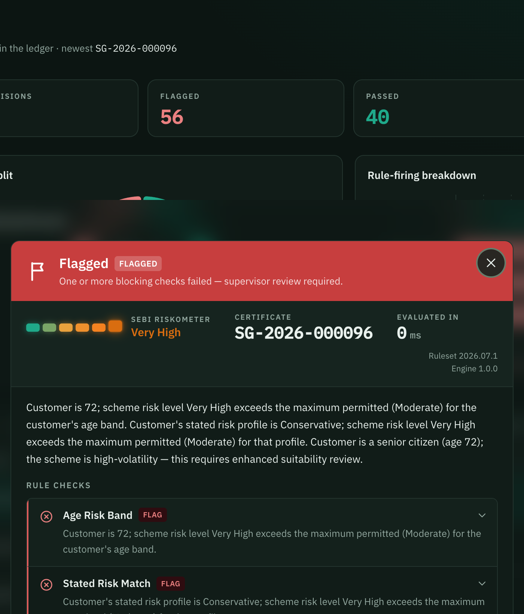
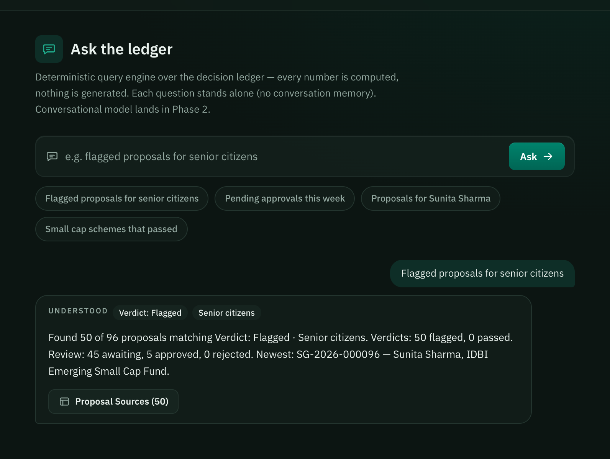
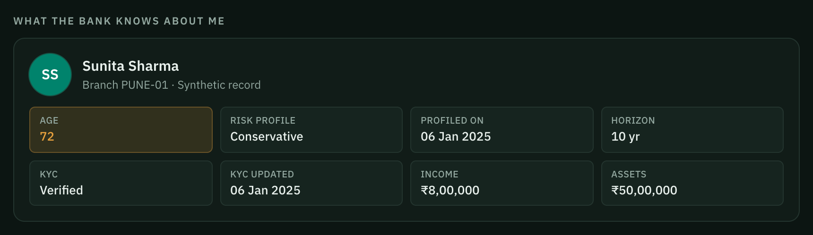
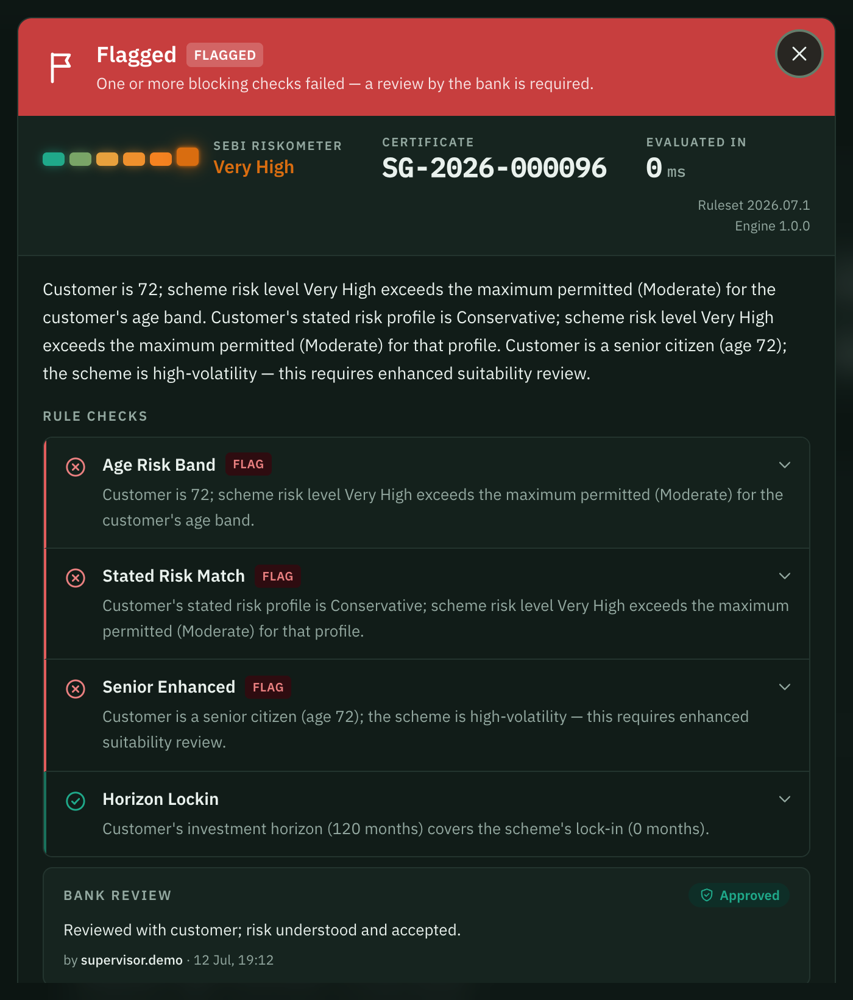

# Walkthrough — one decision, three roles

A self-contained tour of SuitabilityGate, running entirely on `localhost`. No cloud, no external
network, nothing to configure beyond the demo logins below.

Everything here traces **one decision** — a small-cap fund proposed for a 72-year-old conservative
investor — as it moves from the relationship manager's screen, through the deterministic gate, to a
supervisor's mandatory human approval, and finally into the customer's own transparency portal. Every
number and every quoted sentence in this walkthrough is taken directly from the running app; nothing
below is invented for narrative effect.

**Before you start:** bring the stack up (`docker compose up -d --build`, or `./scripts/launch.sh` for
local dev — see the README [Quickstart](../README.md#-quickstart)) and open **http://localhost:5173**.
Three demo identities, all password `password`: `rm.demo` (relationship manager), `supervisor.demo`
(compliance), `customer.demo` (the investor). The ledger ships pre-seeded, so every screen below is
populated from the first login — there is no empty state to work around.

---

## 1 · Sign in

One login screen, three roles. Each demo identity chip fills the username for you — pick `rm.demo` and
sign in as the relationship manager. The rest of this walkthrough follows that identity first, then
switches to `supervisor.demo` and finally `customer.demo` to show the same decision from every side.

## 2 · The RM lands on Prospects — a worklist, not a blank form

The relationship manager's **first screen is not a proposal form — it's a worklist.** "Prospects" is a
deterministic, searchable list: every customer paired with a fund that *already clears the suitability
gate* for them. Typing a name filters it instantly — no ranking model, just a plain search over the
customer catalogue.

Sunita Sharma's card carries a bright orange **"Existing client"** badge — she already has decisions on
record, so the RM can see at a glance who's an established client versus a fresh prospect. Her suggested
plan, IDBI Balanced Advantage Fund at a ₹5,000 monthly SIP, is computed the same way every suggestion in
this app is: the co-pilot screens the whole scheme catalogue through the *real* gate and keeps only what
passes. It cannot suggest a product its own gate would flag.

Clicking her card takes the RM straight to the Evaluate form, pre-filled with exactly this plan — no
retyping the customer, the scheme, or the amount.

## 3 · Evaluate — the AI-assisted suggestion, reviewed

This is the same suggestion, now sitting inside the Evaluate workbench (reachable the same way even
without clicking a Prospects card — an RM can pick any customer and hit "Suggest a plan" directly from
here). The panel is explicit about what it is: an **AI-assisted suggestion**, not a decision. The RM
reviews it, can edit any field, and nothing is recorded until Evaluate — and then Submit — are pressed.

To show what the gate actually catches, the walkthrough now does what a real RM might: override the
safe suggestion and propose something genuinely unsuitable.

## 4 · Evaluate — and it flags

Swap the scheme to the **IDBI Emerging Small Cap Fund** — a Very-High-risk product — and hit **Evaluate**.
This is a *preview*: the same deterministic rules run, but nothing is recorded yet, so the RM can iterate
freely before committing anything to the ledger.

Three rules fail here, each with a plain-English reason computed from the actual customer and scheme
data, not a template:

- **Age Risk Band** — the scheme's risk level exceeds what's permitted for her age bracket.
- **Stated Risk Match** — the scheme's risk level exceeds her own stated (Conservative) risk profile.
- **Senior Enhanced** — a stricter composite check that applies specifically because she's a senior
  citizen.

**Horizon Lockin** passes — her 10-year horizon comfortably covers the fund's lock-in — which is the
point: a verdict is a *composite* of independent checks, not a single pass/fail switch, and every rule's
reasoning is visible whether it passed or failed.

## 5 · Submit — the decision is recorded

Submitting **freezes this exact preview into the ledger** — same rules, same verdict, now permanent. The
record carries a human-readable certificate number, the ruleset and engine versions that produced it,
and its own evaluation time in milliseconds: the gate reports how long it took, per decision, rather than
asking anyone to take the number on faith.

Two things are true immediately: the AI contribution panel is already rendering plain-language prose
(strictly downstream of the frozen record — it explains the verdict, it did not produce it), and
**"Supervisor approval: Pending"** — nothing is final yet. Humans stay in the loop on every decision, not
just flagged ones.

## 6 · Compliance — the whole ledger, one dashboard

Sign out and back in as `supervisor.demo`. The compliance officer's landing screen is a live dashboard
over the same ledger every decision writes to: total decisions, the flagged/passed split, and a
rule-firing breakdown showing exactly which checks are catching the most proposals. The decisions table
below it is searchable and filterable, and the row for Sunita Sharma's just-submitted decision is right
at the top — newest first.

*(The branch × week heatmap and weekly trend widgets are honestly labelled "Phase 2" placeholders — they
need multi-week seeded history to be meaningful, which is a deliberate Phase-2 scope decision, not an
unfinished feature.)*

## 7 · The supervisor's mandatory review

Clicking the row opens the same rule-by-rule breakdown the RM saw, now from the compliance side: every
input each rule consumed, the threshold it was checked against, and the exact plain-English reasoning —
nothing is hidden or summarized away. **Every** decision — passed or flagged — requires an explicit
Approve or Reject from a supervisor, with a mandatory written justification. This review is *appended* to
the record, never merged into it: the original decision stays exactly as the gate computed it, forever.

## 8 · Ledger Copilot — ask the ledger a question

The compliance role also gets a natural-language query surface over the ledger. Typed here:
*"Flagged proposals for senior citizens."* The answer is not generated — it's **computed**: a
deterministic parser reads the question into a structured filter (shown as "Understood" chips, so the
interpretation is never hidden), code filters the real records, and the sentence that comes back states
only counts that were actually retrieved. "Proposal Sources" opens the exact matching rows in the
dashboard table. No model is involved anywhere in this path today — that's the whole point: an audit tool
that provably cannot fabricate a number.

## 9 · The customer's own view

Sign out again and in as `customer.demo` — the investor's own account, scoped strictly to their own
data. "What the bank knows about me" shows exactly the profile fields the gate evaluated against: age,
risk category, income, assets, KYC status. Nothing more, nothing hidden.

## 10 · Why it was flagged, in plain language

The customer can open any of their own decisions and see the same rule checks the RM and the supervisor
saw — same reasoning, same transparency, just framed for the person the decision was actually about. The
supervisor's review appears here too, labelled "Bank review" rather than "Supervisor approval," with the
same justification text: *"Reviewed with customer; risk understood and accepted."* One record, rendered
three times for three audiences, and none of the three ever disagree — because they're the same record.

---

## The thread through all ten screens

Every one of these views — the RM's worklist, the preview, the frozen record, the dashboard, the
copilot's answer, the customer's own page — is a rendering of **one decision object**, computed once by
deterministic rules and never mutated afterward. The co-pilot suggests, a human decides to propose it,
code decides the verdict, and a human supervisor has the final word. If this sale is ever questioned —
by the fund house, by SEBI, or by the bank's own compliance function — the answer is this exact record,
not a reconstruction assembled after the fact.

A demo video covering the same ground is planned for Phase 2; this document is the Phase-1 walkthrough,
and it's meant to be followed step-by-step against your own running instance, not just read.

**Troubleshooting:** if a screen looks empty or a login fails, confirm all three services are up
(`docker compose ps`, or check ports `5173` / `8080` / `11111`) and that you're using the exact demo
credentials above — no other accounts exist in Phase 1.
